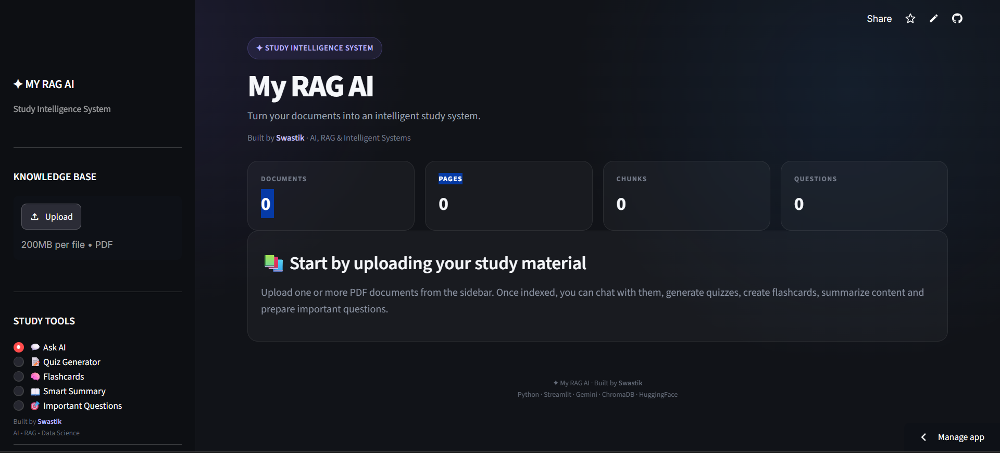

# ✦ My RAG AI

> **An AI-powered study assistant that turns your PDFs into an interactive learning workspace.**

🚀 **[Live Demo](https://rag-ai-assistance.streamlit.app/)**



---

## ⚡ What is My RAG AI?

**My RAG AI** is a document-based AI study assistant built using **Retrieval-Augmented Generation (RAG)**.

Upload your study PDFs, ask questions about their content, and use AI-powered study tools to turn the same material into a more interactive revision workspace.

The application retrieves relevant information from uploaded documents before generating responses, helping keep answers grounded in the provided study material.

---

## 🚀 Features

* 💬 **Ask AI** — Ask questions grounded in your uploaded documents
* 📝 **Quiz Generator** — Generate quizzes from your study material
* 🧠 **Flashcards** — Create interactive revision flashcards
* 📖 **Smart Summary** — Generate focused summaries from your PDFs
* 🎯 **Important Questions** — Identify questions worth preparing
* 📚 **Source References** — See the document and page supporting retrieved information
* 🔎 **Similarity + MMR Retrieval** — Retrieve relevant and diverse document context
* 🛡️ **Fallback Handling** — Provides a local document-based fallback when AI generation is unavailable

---

## 🧠 RAG Pipeline

```text
PDF Upload
    ↓
Text Extraction
    ↓
Document Chunking
    ↓
HuggingFace Embeddings
    ↓
Chroma Vector Database
    ↓
Similarity Search + MMR
    ↓
Relevant Context Selection
    ↓
Gemini AI
    ↓
Grounded Response + Sources
```

### How it works

1. 📄 **Upload** — Study PDFs are uploaded to the application.
2. ✂️ **Chunking** — Extracted text is split into smaller overlapping chunks.
3. 🧠 **Embedding** — Chunks are converted into vector embeddings using HuggingFace.
4. 🗄️ **Storage** — Embeddings are stored in a Chroma vector database.
5. 🔎 **Retrieval** — Similarity search and MMR retrieve relevant document context.
6. 🤖 **Generation** — Gemini generates a response using the retrieved context.
7. 📚 **Sources** — Relevant document/page information is shown alongside the response.

---

## 🛠️ Tech Stack

| Technology                 | Purpose                            |
| -------------------------- | ---------------------------------- |
| **Python**                 | Application logic                  |
| **Streamlit**              | Web application and UI             |
| **Google Gemini**          | AI response generation             |
| **LangChain**              | Text processing and RAG components |
| **ChromaDB**               | Vector database                    |
| **HuggingFace Embeddings** | Document embeddings                |
| **PyPDF**                  | PDF text extraction                |

---

## 📁 Project Structure

```text
My-RAG-AI/
│
├── app.py
├── test.py
├── requirements.txt
├── README.md
└── .gitignore
```

---

## 🚀 Run Locally

### 1. Clone the repository

```bash
git clone https://github.com/swasbuildsforlife/my-rag-ai.git
cd my-rag-ai
```

### 2. Install dependencies

```bash
pip install -r requirements.txt
```

### 3. Configure Gemini API

Set your Gemini API key as an environment variable:

```text
GEMINI_API_KEY=your_api_key
```

### 4. Run the application

```bash
streamlit run app.py
```

The application will open in your browser.

---

## 🌐 Live App

Try **My RAG AI** here:

🚀 **[Open Live Demo](https://rag-ai-assistance.streamlit.app/)**

---

## 🔮 Future Improvements

* Persistent document storage
* OCR support for scanned PDFs
* RAG evaluation and retrieval metrics
* Improved document management
* More advanced study analytics

---

## 👨‍💻 Built By

**Swastik**

Built with ✦, Python, RAG and a lot of learning.

[GitHub](https://github.com/swasbuildsforlife)

---
